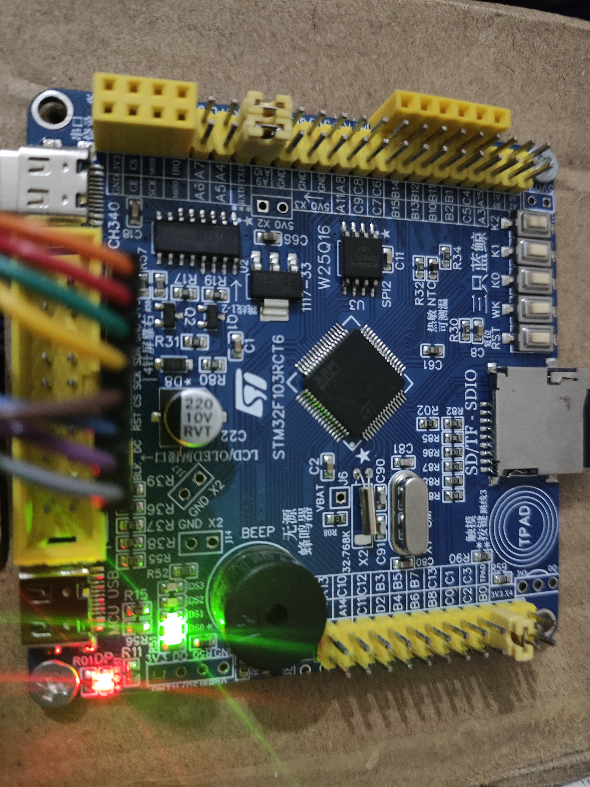
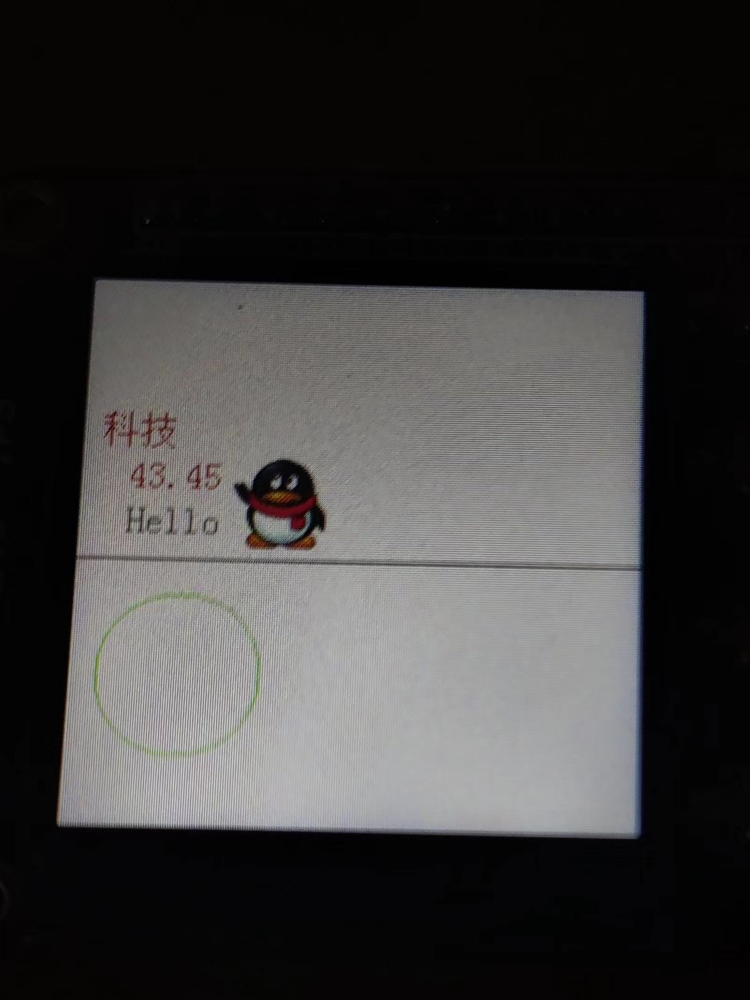

# STM32F103RCT6_ST7789_Driver
Transplanting 1.3 inch ST7789 screen driver on STM32F103RCT6 development version

The warehouse is the transplantation of ST7735S module and ST7789 of STM32F103C8T6. There is no problem at present, so it can be used after compilation and download.

You can read the `lcd.h` header file by yourself to draw the screen.

## The board I use

## Show

